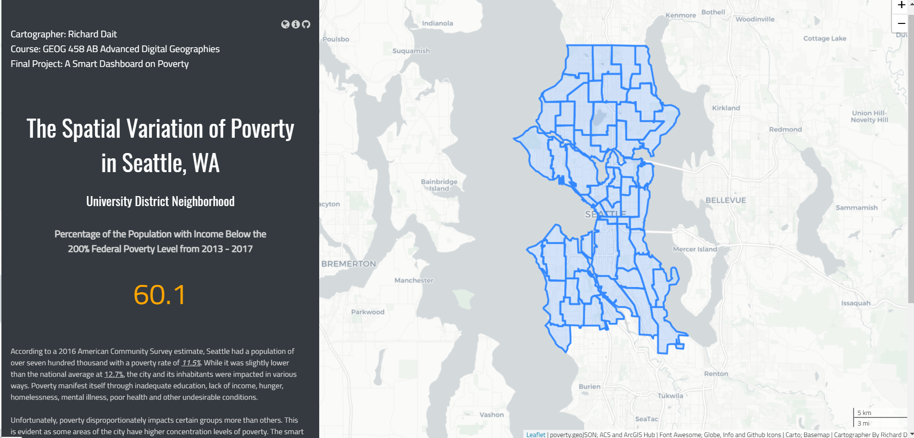

<h3> Richard Dait
<h3> GEOG 458 AB
<h3> 03/17/2021

 
 

<h1> 
 <b> Final Project: The Geography of Poverty in Seattle, WA Smart Dashboard</b> 
  

<h4> <b> Introduction and Description</b> </h4>

 <h5>
&nbsp; &nbsp; According to a 2016 American Community Survey estimate, Seattle had a population of over seven hundred thousand
and a poverty rate of <a href="https://www.seattle.gov/opcd/population-and-demographics/about-seattle#prosperity"><i>11.5%</i></a>.
While it was slightly lower than the national average at
<a href="https://www.census.gov/library/publications/2017/demo/p60-259.html#:~:text=The%20official%20poverty%20rate%20in,14.8%20percent%20to%2012.7%20percent.12.7%">
12.7%</a>, the city and its inhabitants were impacted in various ways. Poverty manifest itself through
inadequate education, lack of income, hunger, homelessness, mental illness, poor health and other undesirable
conditions. Unfortunately, poverty disproportionately impacts certain groups more than others. This is evident as some areas of the city have higher concentration levels of poverty.
 
 
&nbsp;&nbsp; The smart dashboard illustrates the geography of poverty in Seattle, WA
from 2013 -2017. Data were obtained from a five year series via American Community Survey (ACS) and  <a href="https://data-seattlecitygis.opendata.arcgis.com/datasets/a-community-reporting-areas-profile-acs-5-year-2013-2017?geometry=-122.858%2C47.534%2C-121.815%2C47.696"> Seattle Open Data Portal</a>. The name of the neighborhood along with percentage of the population with income
below the 200% federal poverty level from 2013 - 2017 is displayed once you click on a census tract polygon. </h5> 

<h4> <b> Goals</b> </h4> <h5> 
&nbsp;&nbsp; There were many goals to this project. The first was to challenge myself and see what my programming and GIS skills were made of. I can confidently say that I did an adirable job, given the time and other obligations. Another goal was to learn as much as possible and practice as I go. Since I have every intention to work in data science or the tech arena, the final project provided me the rigor and practicalities needed to move forward. Last, but most importantly, I wanted to build a web project that illustrated a real-world issue that is relevant and impacts a wide range of individuals. While the smart dashboard only brings to light the geography of poverty in Seattle, WA, this is a good starting point for organizations and politicians to target areas where it is highly concentrated. That way, the vulnerable and those suffering would receive adequate care and support.</h5>

<h4> <b> Data Sources and References
</b>
<h5>
<li>City of Seattle Open Data Portal. 2021. <i>A Community Reporting Areas Profile ACS 5-year 2013-2017.</i>https://data-seattlecitygis.opendata.arcgis.com/datasets/a-community-reporting-areas-profile-acs-5-year-2013-2017?geometry=-122.858%2C47.534%2C-121.815%2C47.696 (Accessed on 03/17/2021).</li> <li>City of Seattle. <i>Prosperity Quick Statistics: About People Living in Seattle.</i> https://www.seattle.gov/opcd/population-and-demographics/about-seattle#prosperity (Accessed on 03/16/2021).</li>  <li>United States Census Bureau. 2017. <i>Income and Poverty in the United States: 2016</i>https://www.census.gov/library/publications/2017/demo/p60-259.html#:~:text=The%20official%20poverty%20rate%20in,14.8%20percent%20to%2012.7%20percent.12.7% (Accessed on 03/16/2021).</li></h5>

</h4> <h5> 

<h4> <b> Applied Libraries and Web Services</b> </h4>
<h5>
<ol><li>Leaflet<li>C3<li>D3<li>CSS<li>Javascript<li>Jquery<li>CartoDB<li>Github<li>Font Awesome<li>ArcGIS Hub</ol></h5>

<h4> <b> Acknowledgment and Credits
</b> </h4> <h5> 

First and foremost, I would like to thank Professor Bo Zhao and Tyler McCrea for their continuous support and understanding throughout this trying quarter. Both were instrumental in guiding me in the right direction, furthering my knowledge in digital geographies and assisting me with the final project. As for the smart dashboard, the basemap is from CartoDB. The project html and its various components, are host via <a href="https://github.com/richdait/Final_Project_Poverty">Github</a>. The globe, info and github icons are courtesy of <a href="https://fontawesome.com/">Font Awesome</a>. Lastly, credit goes out to <a href="https://leafletjs.com/">Leaflet</a>for giving me a platform to build amazing web applications such as this poverty smart dashboard.
